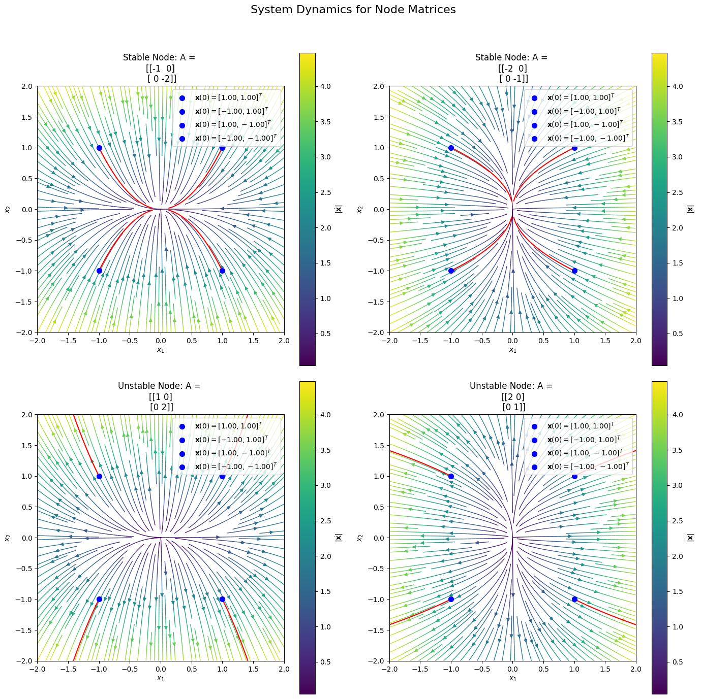
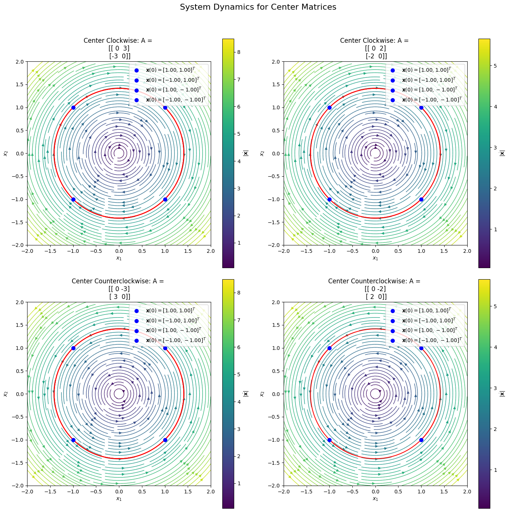
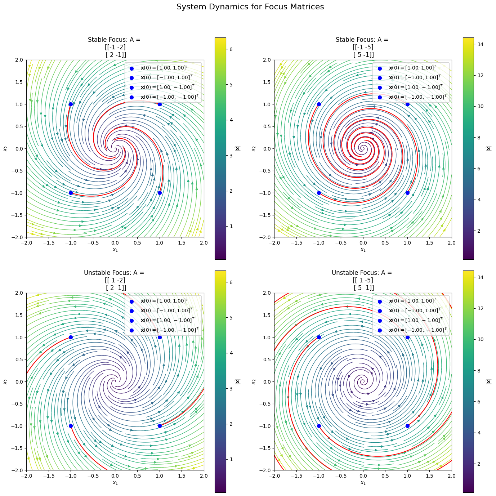
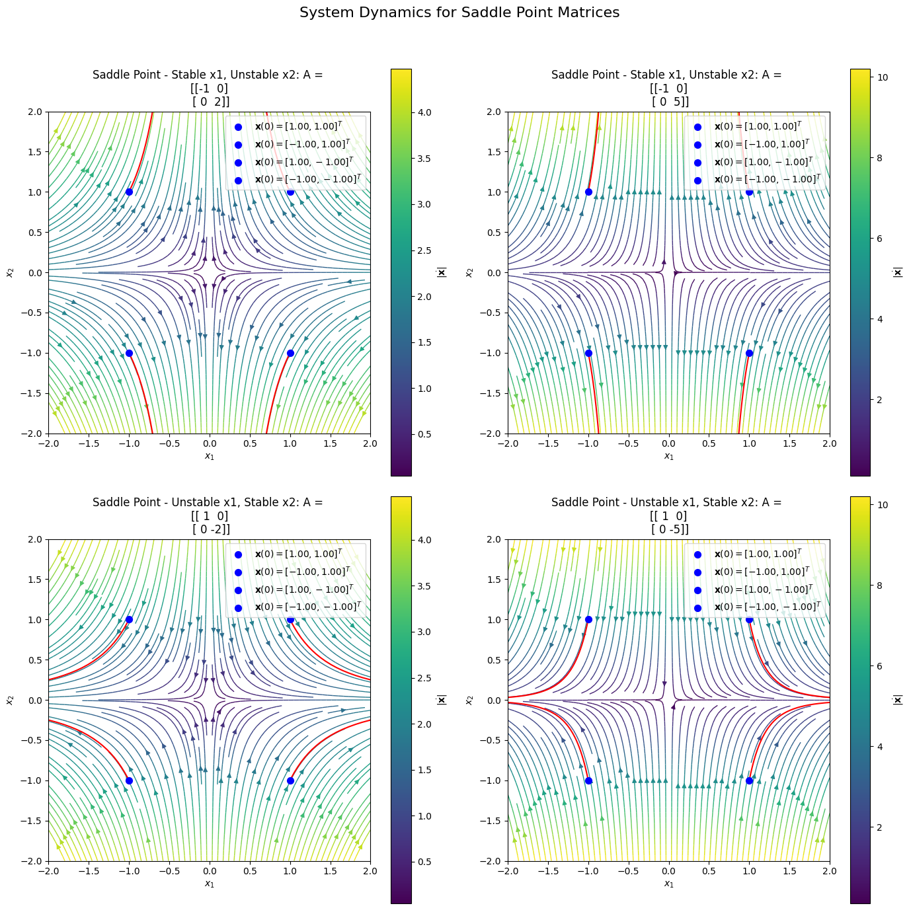
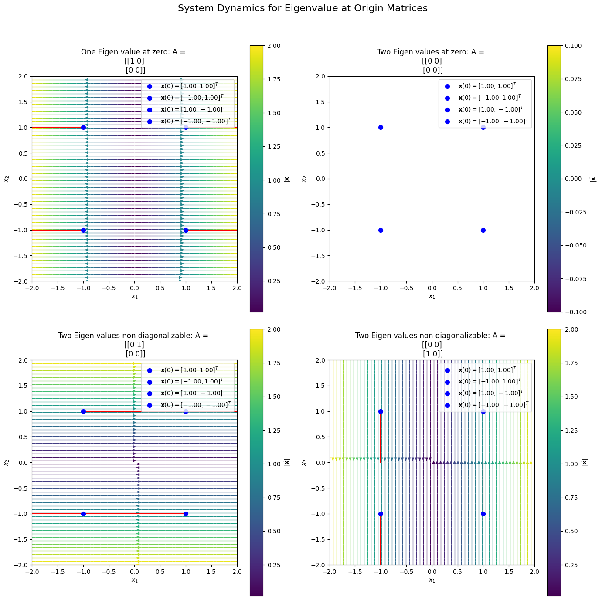

# Stability of Second-Order Systems with Drake

Second-order systems become much easier to understand once you stop looking at them only as equations and start looking at them as motion in the phase plane.

For a linear system of the form

$$
\dot{x} = Ax, \qquad A \in \mathbb{R}^{2\times 2},
$$

the origin is usually the key equilibrium point, and its behavior is determined by the eigenvalues of \(A\). Depending on those eigenvalues, the origin can behave like a **node**, **center**, **focus**, or **saddle**. That exact classification is also how the lecture notes organize second-order systems.

What makes this topic interesting is that stability is not just algebra. It is geometric. A phase portrait lets you see whether trajectories move toward the origin, rotate around it, or escape away from it. [This drake notebook](https://github.com/cshreyastech/Learnings/blob/ControlSystems/NPTEL_non_linear_dynamics/01_Lec01_introduction/03_lecture3_second_order_systems.ipynb) builds this intuition nicely by defining a reusable `LinearDynamicsSystem` class, simulating $$ \(\dot{x}=Ax\) $$ using `SymbolicVectorSystem`, and plotting trajectories together with `plot_2d_phase_portrait`. It then compares multiple matrices side by side to show the different equilibrium types visually.

---

## Why phase portraits are so useful

A phase portrait places an arrow at every point in the `(x1, x2)` $$ plane. That arrow tells you the direction of motion from that state. Once those arrows are drawn, the qualitative behavior becomes almost immediate:

- arrows pointing inward suggest attraction,
- arrows pointing outward suggest instability,
- arrows that rotate without shrinking create closed orbits,
- arrows that rotate while shrinking or growing create spirals.

This is the same visual reasoning used in the lecture notes when discussing second-order systems: stable node, unstable node, center, stable focus, unstable focus, and saddle point are all distinguished by their flow pattern in the phase plane.

---

## The Drake setup

The notebook uses Drake to construct and simulate systems of the form

$$
\dot{x} = Ax.
$$

It defines a helper class called `LinearDynamicsSystem` that:

1. stores a matrix A,
2. builds a Drake `SymbolicVectorSystem`,
3. simulates trajectories from chosen initial conditions,
4. plots the vector field and trajectories on the same axes,
5. compares multiple systems in a grid.

That is a clean workflow for learning stability because it turns each matrix into something you can immediately see.

---
## Different types of Equilibrium points

### 1. Stable and unstable nodes

Lets start with four simple examples, including two node cases and two center cases. The node examples use the matrices

```math
A =
\begin{bmatrix}
-1 & 0\\
0 & -2
\end{bmatrix}
\qquad\text{and}\qquad
A =
\begin{bmatrix}
1 & 0\\
0 & 2
\end{bmatrix}
```

labeled in the notebook as **Stable Node** and **Unstable Node**.

#### Stable node

When both eigenvalues are real and negative, trajectories move toward the origin. There is no rotation here because the matrix is diagonal, so the motion is aligned with the coordinate axes. In the lecture notes, this is described as a stable node: distinct real eigenvalues, both negative, with arrows directed toward the origin.

This is the cleanest picture of asymptotic stability. Nearby states not only remain close to the equilibrium, they eventually converge to it.

#### Unstable node

If both eigenvalues are real and positive, the picture flips. All nearby trajectories move away from the origin. The lecture notes classify this as an unstable node: distinct real eigenvalues, both positive.



/mnt/localcodebase/Courses/cshreyastech.github.io/Blogs/asserts/images/2026-04-13-stability-of-second-order-systems
So the geometry changes completely even though the system structure looks almost identical. The sign of the eigenvalues is doing all the work.

---

### 2. Centers: motion without convergence

The notebook then uses the matrices

```math
A =
\begin{bmatrix}
0 & 3\\
-3 & 0
\end{bmatrix}
\qquad\text{and}\qquad
A =
\begin{bmatrix}
0 & -3\\
3 & 0
\end{bmatrix}
```

labeled **Center Clockwise** and **Center Counterclockwise**.

These correspond to purely imaginary eigenvalues. In the lecture notes, this case is called a **center**. The trajectories form periodic orbits around the origin, and the sign pattern in the off-diagonal entries determines clockwise versus counterclockwise rotation. 



A center is an important reminder that **stability does not always mean convergence**. Trajectories stay near the origin if they start near it, but they do not spiral in. They keep circling forever. The lecture notes emphasize this point clearly: for linear systems with purely imaginary eigenvalues, you get a continuum of periodic orbits rather than a single isolated orbit.

---

## 3. Stable and unstable focus

The next group in the notebook uses

```math
A =
\begin{bmatrix}
-1 & -2\\
2 & -1
\end{bmatrix}
\qquad\text{and}\qquad
A =
\begin{bmatrix}
1 & -2\\
2 & 1
\end{bmatrix}
```
labeled **Stable focus** and **Unstable focus**.

### Stable focus

A stable focus occurs when the eigenvalues are complex and their real part is negative. The off-diagonal entries create rotation, while the negative real part pulls trajectories inward. The result is a spiral that approaches the origin asymptotically. The lecture notes describe this exactly as a stable focus: rotation plus inward motion.

This is one of the most common phase portraits in control systems because many damped oscillatory systems look like this.

### Unstable focus

If the real part becomes positive, the spiral reverses in the stability sense: it still rotates, but now trajectories grow away from the origin. That is the unstable focus. The lecture notes classify this as the complex-eigenvalue case with positive real part.



A simple mental model helps here:

- the **imaginary part** causes rotation,
- the **real part** decides whether the spiral shrinks or expands.

---

## 4. Saddle point: stable in one direction, unstable in another

The notebook also includes the saddle examples

```math
A =
\begin{bmatrix}
-1 & 0\\
0 & 2
\end{bmatrix}
\qquad\text{and}\qquad
A =
\begin{bmatrix}
1 & 0\\
0 & -2
\end{bmatrix}
```

both labeled **Saddle Point**.

A saddle happens when one eigenvalue is negative and the other is positive. The lecture notes use this exact diagonal idea and show that one component decays while the other grows, which makes the origin unstable overall.



This is a subtle but important equilibrium type. Along one direction, the flow moves toward the origin. Along another, it moves away. So even though some trajectories approach the equilibrium, the equilibrium itself is still unstable.

That is why the notebook title, **Attractivity vs Stability**, is a useful framing device. A system can have directions that look attractive and still fail to be stable overall. The first-order lecture notes make the same conceptual distinction in a simpler setting: whether nearby trajectories merely stay close or actually move toward an equilibrium are related but different questions.

---

## Stability, attractivity, and asymptotic stability

This topic becomes much clearer when these three ideas are separated:

### Stability

If you start close to the equilibrium, you stay close.

### Attractivity

If you start sufficiently near the equilibrium, you move toward it as time increases.

### Asymptotic stability

The equilibrium is both stable and attractive.

That distinction explains the phase portraits nicely:

- **stable node** → asymptotically stable,
- **stable focus** → asymptotically stable,
- **center** → stable but not attractive,
- **saddle** → unstable.

---

## Beyond the standard classification

Beyond the standard classification: it also includes matrices with one or two zero eigenvalues, such as

```math
\begin{bmatrix}
1 & 0\\
0 & 0
\end{bmatrix},
\quad
\begin{bmatrix}
0 & 0\\
0 & 0
\end{bmatrix},
\quad
\begin{bmatrix}
0 & 1\\
0 & 0
\end{bmatrix},
\quad
\begin{bmatrix}
0 & 0\\
1 & 0
\end{bmatrix}
```

One eigenvalue at zero, two eigenvalues at zero, and non-diagonalizable zero-eigenvalue cases.

This is the effect of repeated eigenvalues and zero eigenvalues need separate treatment. They are not covered by the simple “node-center-focus-saddle” rule and often require a more careful invariant-set or Jordan-form analysis.



---

## A minimal Drake example

Here is a compact Drake example based on the same structure used in the notebook:

```python
import matplotlib.pyplot as plt
import numpy as np
from pydrake.all import (
    DiagramBuilder,
    LogVectorOutput,
    Simulator,
    SymbolicVectorSystem,
    Variable,
)
from underactuated import plot_2d_phase_portrait

A = np.array([[-1, -2],
              [ 2, -1]])  # stable focus

x1 = Variable("x1")
x2 = Variable("x2")
x = np.array([x1, x2], dtype=object).reshape(-1, 1)

dynamics = np.array([
    A[0, 0] * x1 + A[0, 1] * x2,
    A[1, 0] * x1 + A[1, 1] * x2
], dtype=object).reshape(-1, 1)

builder = DiagramBuilder()
system = builder.AddSystem(
    SymbolicVectorSystem(state=x, output=x, dynamics=dynamics)
)
logger = LogVectorOutput(system.get_output_port(0), builder)
diagram = builder.Build()

simulator = Simulator(diagram)
context = simulator.get_mutable_context()
context.SetContinuousState([1.0, 1.0])
simulator.AdvanceTo(2.0)

plt.figure(figsize=(6, 6))
plot_2d_phase_portrait(
    lambda x: [
        A[0, 0] * x[0] + A[0, 1] * x[1],
        A[1, 0] * x[0] + A[1, 1] * x[1]
    ],
    x1lim=[-2, 2],
    x2lim=[-2, 2]
)
traj = logger.FindLog(context).data()
plt.plot(traj[0, :], traj[1, :], "r")
plt.scatter(1.0, 1.0, c="b", s=50)
plt.xlabel("$x_1$")
plt.ylabel("$x_2$")
plt.title("Stable Focus")
plt.show()
```
---

## 3. Final Takeaways
* The stability of a second-order linear system is determined by the eigenvalues of $A$.
* Two negative real eigenvalues produce a stable node.
* Two positive real eigenvalues produce an unstable node.
* Purely imaginary eigenvalues produce a center, where trajectories circle but do not converge.
* Complex eigenvalues with negative real part produce a stable focus, where trajectories spiral inward.
* Complex eigenvalues with positive real part produce an unstable focus, where trajectories spiral outward.
* One positive and one negative real eigenvalue produce a saddle point, which is always unstable.
* A phase portrait turns these cases into something visual and intuitive.
* Drake makes this especially effective because it lets you simulate the system and see the geometry directly.